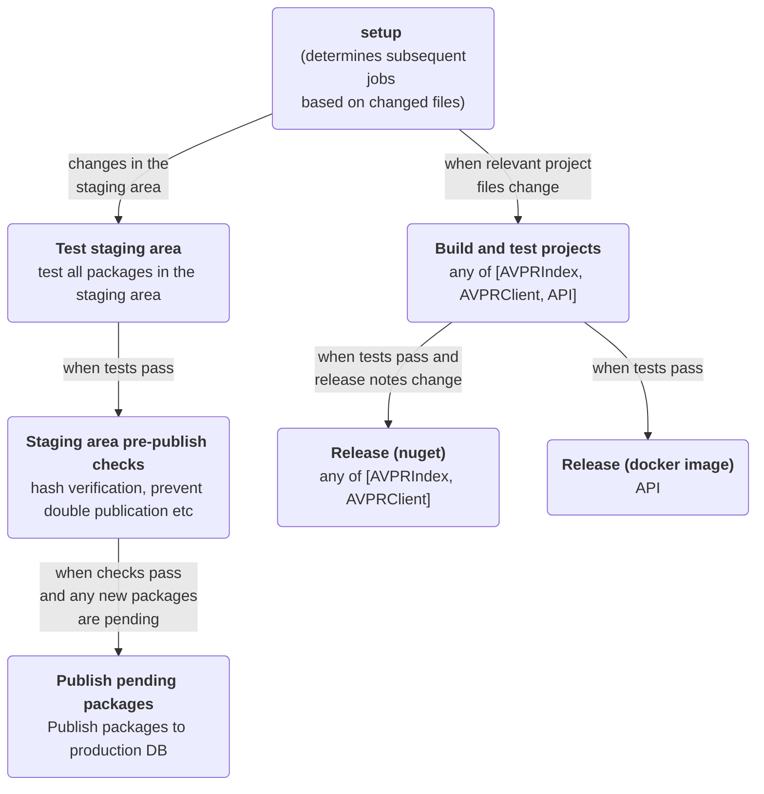

# Introduction

The **arc-validate-package-registry (avpr)** repository contains:

- a staging area for authoring official validation packages intended for use with [`arc-validate`](https://github.com/nfdi4plants/arc-validate).
- a web API for serving validation packages. This API is consumed by `arc-validate` to install and sync validation packages.
- a website for browsing validation packages.
- some domain types and utilities relevant for consuming libraries in the [AVPRIndex library](./src/AVPRIndex/)
- a .NET client library for consuming the web API in the [AVPRClient library](./src/AVPRClient/)

Read more at [avpr.nfdi4plants.org/about](https://avpr.nfdi4plants.org/about)

# Table of contents

- [General](#general)
  - [CI/CD pipeline](#cicd-pipeline)
- [Validation package staging area](#validation-package-staging-area)
  - [Allowed validation package file formats](#allowed-validation-package-file-formats)
  - [Automated package testing](#automated-package-testing)
  - [Package publication workflow](#package-publication-workflow)
  - [Package publication tutorial](#package-publication-tutorial)
  - [Versioning packages](#versioning-packages)
- [Package metadata](#package-metadata)
  - [YAML frontmatter](#yaml-frontmatter)
  - [Frontmatter bindings](#frontmatter-bindings)
  - [Mandatory fields](#mandatory-fields)
  - [Optional fields](#optional-fields)
    - [Objects](#objects)
      - [Author](#author)
      - [Tag](#tag)
- [Development](#development)
  - [AVPRIndex and AVPRClient libraries](#avprindex-and-avprclient-libraries)
    - [Triggering a nuget release](#triggering-a-nuget-release)
  - [Web API and website (PackageRegistryService)](#web-api-and-website-packageregistryservice)
    - [Triggering a image release](#triggering-a-image-release)
    - [OpenAPI endpoint documentation via Swagger UI](#openapi-endpoint-documentation-via-swagger-ui)
  - [Testing](#testing)
  - [Release packages to production](#release-packages-to-production)

# General

## CI/CD pipeline

This repo runs an [extensive CI/CD pipeline](.github/workflows/pipeline.yml) on every commit and PR on the `main` branch. The pipeline includes:

- tests and pre-publish checks for every package in the [staging area](#validation-package-staging-area).
- a release pipeline for validation packages:
  - publishing stable packages to the production instance of the web API at [avpr.nfdi4plants.org](https://avpr.nfdi4plants.org)
- tests and release pipelines for the `AVPRIndex` and `AVPRClient` libraries, as well as a docker container for the `PackageRegistryService` web API.



[🔼 Back to top](#table-of-contents)

# Validation package staging area

The [package staging area](./StagingArea) is intended for development and testing of validation packages.

Files in this folder must follow the naming convention `<package-name>@<major>.<minor>.<patch>.*` and contain a [yml frontmatter](#package-metadata) at the start of the file. These files must additionally be inside a subfolder exactly named as the package name. This leads to a folder structure like this:

```no-highlight
StagingArea
│ 
├── some-package
│   ├── some-package@1.0.0.fsx
│   ├── some-package@2.0.0.fsx
│   └── some-package@2.1.0.fsx
│
├── some-python-package
│   ├── some-python-package@1.0.0.py
│   ├── some-python-package@2.0.0.py
│   └── some-python-package@2.1.0.py
│
└── some-other-package
    ├── some-other-package@1.0.0.fsx
    ├── some-other-package@2.0.0.fsx
    └── some-other-package@3.0.0.fsx
```

## Allowed validation package file formats

Validation packages must be **self-contained, single-file scripts**.

The following programming languages can be used to create validation packages:

- `F# (.fsx)`
  - software package management in F# scripts MUST use `#r nuget ...` directives to reference any external dependencies.
  - F# scripts are executed via `dotnet fsi`.
- `Python (.py)`
  - software package management in Python scripts MUST use [uv inline script dependencies](https://docs.astral.sh/uv/guides/scripts/#declaring-script-dependencies) to reference any external dependencies.
  - Python scripts are executed via `uv run`.

## Automated package testing

Any change to a package in the staging area triggers the tests located at [/StagingAreaTests](./StagingAreaTests), which are run on every package. (see also [CI/CD pipeline](#cicd-pipeline)). publishing packages to the production registry is only possible if all tests pass.

## Package publication workflow

In principle, packages can be published via 2 channels:

Packages committed to the staging area will be published to the production registry database (https://avpr.nfdi4plants.org) if they pass all tests and pre-publish checks. 

## Package publication tutorial

Publishing a package to the registry is a multi-step process:

Suppose you want to develop version 1.0.0 of a package called `my-package`.

1. fork this repo
2. Add a new blank `my-package@1.0.0.fsx` file to the [staging area](./StagingArea/) in the folder `my-package`.
3. Develop the package, using a work-in-process pull request to use this repository's CI to perform automated integrity tests on it. 
4. Once the package is ready for production use, add `publish: true` to the [yml frontmatter](#package-metadata) of the package file. This will trigger the CI to build and push the package to the registry once the PR is reviewed and merged.
5. Once a package is published, it cannot be unpublished or changed. To update a package, create a new script with the same name and a higher version number.

| stage | availability | mutability |
| --- | --- | --- |
| staging: development in this repo | version of current HEAD commit in this repo via github API-based execution in `arc-validate` CLI | any changes are allowed |
| published: available in the registry | version of the published package via the registry API | no changes are allowed |

## Versioning packages

Packages SHOULD be versioned according to the [semantic versioning](https://semver.org/) standard. This means that the version number of a package should be incremented according to the following rules:

- **Major version**: incremented when you make changes incompatible with previous versions
- **Minor version**: incremented when you add functionality in a backwards-compatible manner
- **Patch version**: incremented when you make backwards-compatible bug fixes

[🔼 Back to top](#table-of-contents)

# Package metadata

## FSharp

### YAML frontmatter

Package metadata is extracted from **yml frontmatter** at the start of the `.fsx` file, indicated by a multiline comment (`(* ... *)`)containing the frontmatter fenced by `---` at its start and end:
  
```fsharp
(*
---
<yaml frontmatter here>
---
*)
```

### Frontmatter bindings

You can additionally bind YAML frontmatter as a string inside your package. **This is recommended** because you can now re-use the metadata in your package code.

This binding must be placed at the start of the file to the name `PACKAGE_METADATA` with a `[<Literal>]` attribute _exactly_ like this:

```fsharp
let [<Literal>] PACKAGE_METADATA = """(*
---
<yaml frontmatter here>
---
*)"""
```

further down in your package code, you can now extract and use this metadata. This for example prevents you from having to repeat the package name in your package code.

```fsharp
#r "nuget: ARCExpect"
#r "nuget: AVPRIndex"
let metadata = ValidationPackageMetadata.extractFromString PACKAGE_METADATA

let validationCases = ...

cases
|> Execute.ValidationPipeline(
    metadata = metadata // use metadata to determine output paths and names instead of doing it manually
)
```

## Python

### YAML frontmatter

Package metadata is extracted from **yml frontmatter** at the start of the `.py` file, guarded by triple quotes (`"""`) containing the frontmatter fenced by `---` at its start and end:
  
```python
"""
---
<yaml frontmatter here>
---
"""
```

### Frontmatter bindings

You can additionally bind YAML frontmatter as a string inside your package. **This is recommended** because you can now re-use the metadata in your package code.

This binding must be placed at the start of the file to the name `PACKAGE_METADATA` _exactly_ like this:

```python
PACKAGE_METADATA = """
---
<yaml frontmatter here>
---
"""
```

further down in your package code, you can now extract and use this metadata. This for example prevents you from having to repeat the package name in your package code.

```python
metadata = extract_yaml(PACKAGE_METADATA) #extract yaml object from string
```

## Mandatory fields

| Field | Type | Description |
| --- | --- | --- |
| Name | string | the name of the package |
| MajorVersion | int | the major version of the package |
| MinorVersion | int | the minor version of the package |
| PatchVersion | int | the patch version of the package |
| Summary | string | a single sentence description (<=50 words) of the package |
| Description | string | an unconstrained free text description of the package |

<details>
<summary>Example: only mandatory fields</summary>

```fsharp
(*
---
Name: my-package
MajorVersion: 1
MinorVersion: 0
PatchVersion: 0
Summary: My package does the thing.
Description: |
  My package does the thing. 
  It does it very good, it does it very well. 
  It does it very fast, it does it very swell.
---
*)
let doSomeValidation () = ()
doSomeValidation ()
```

</details>

## Optional fields

| Field | Type | Description |
| --- | --- | --- |
| Publish | bool | a boolean value indicating whether the package should be published to the registry. If set to `true`, the package will be built and pushed to the registry. If set to `false` (or not present), the package will be ignored. |
| Authors | author[] | the authors of the package. For more information about mandatory and optional fields in this object, see [Objects > Author](#author) |
| Tags | string[] | a list of tags with optional ontology annotations that describe the package. For more information about mandatory and optional fields in this object, see [Objects > Tag](#tag)  |
| ReleaseNotes | string[] | a list of release notes for the package indicating changes from previous versions |
| CQCHookEndpoint | string | an optional URL to a CQC Hook endpoint that can be used for continuous quality control (CQC) integration. If provided, this endpoint will be called with validation results after each package execution. |

<details>
<summary>Example: all fields</summary>

```fsharp
(*
---
Name: my-package
MajorVersion: 1
MinorVersion: 0
PatchVersion: 0
Summary: My package does the thing.
Description: |
  My package does the thing. 
  It does it very good, it does it very well. 
  It does it very fast, it does it very swell.
Publish: true
Authors:
  - FullName: John Doe
    Email: j@d.com
    Affiliation: University of Nowhere
    AffiliationLink: https://nowhere.edu
  - FullName: Jane Doe
    Email: jj@d.com
    Affiliation: University of Somewhere
    AffiliationLink: https://somewhere.edu
Tags:
  - Name: validation
  - Name: my-tag
    TermSourceREF: my-ontology
    TermAccessionNumber: MO:12345
ReleaseNotes: |
  - initial release
    - does the thing
    - does it well
CQCHookEndpoint: https://some-url.xd
---
*)
let doSomeValidation () = ()
doSomeValidation ()
```

</details>

### Objects

#### Author

Author metadata about the people that create and maintain the package. Note that the

| Field | Type | Description | Mandatory |
| --- | --- | --- | --- |
| FullName | string | the full name of the author | yes |
| Email | string | the email address of the author | no |
| Affiliation | string | the affiliation (e.g. institution) of the author | no |
| AffiliationLink | string | a link to the affiliation of the author | no |

#### Tag

Tags can be any string with an optional ontology annotation from a controlled vocabulary:

| Field | Type | Description | Mandatory |
| --- | --- | --- | --- |
| Name | string | the name of the tag | yes |
| TermSourceREF | string | Reference to a controlled vocabulary source | no |
| TermAccessionNumber | string | Accession in the referenced controlled vocabulary source | no |

[🔼 Back to top](#table-of-contents)

# Development

Prerequisites:

- .NET 10 SDK
- Docker
- Docker Compose

Advanced local dev functionality has only been tested on Windows with Visual Studio. For that, install the ASP.NET core workload including container features, which will enable running the `Docker Compose` project in Debug mode.

## AVPRIndex and AVPRClient libraries

The `AVPRIndex` and `AVPRClient` libraries are located in `/src` and are intended for use in consuming applications.

To build them, just run `dotnet build` in the respective project folders or build the `arc-validate-package-registry` solution.

### Triggering a nuget release

- Bump the version in the respective `csproj` or `fsproj` file
- Update the respective RELEASE_NOTES.md file
- CI will automatically publish the package to the nuget feed

## Web API and website (PackageRegistryService)

The `PackageRegistryService` project located in `/src` is a simple ASP.NET Core (8) web API that serves validation packages and/or associated metadata via a few endpoints.

It is developed specifically for containerization and use in a docker environment.

To run the `PackageRegistryService` locally, ideally use VisualStudio and run the `Docker Compose` project in Debug mode. This will launch the stack defined at [`docker-compose.yml`](docker-compose.yml), which includes:

- the containerized `PackageRegistryService` application
- a `postgres` database seeded with the [latest indexed packages](src/PackageRegistryService/Data/arc-validate-package-index.json)
- an `adminer` instance for database management (will maybe be replaced by pgAdmin in the future)

In other IDEs, you can run the `PackageRegistryService` project directly or adjust the stack, but you will need to either set up a local postgres database and configure the connection string in `appsettings.json` accordingly or fine-tune the existing docker-compose file..

## Making changes to the data model

Changes in e.g. ValidationPackage metadata need to be reflected at several points in the code:
- PackageRegistryService/Models/ValidationPackage.cs: the main database model
- AVPRIndex/Domain.fs: the client-side model, the respective type here would be `ValidationPackageMetadata`
- EntityFramework migration files in PackageRegistryService/Migrations: these are auto-generated via the `dotnet ef migrations add <MigrationName>` command after making changes to the data model in PackageRegistryService/Models, but might need manual adjustment (e.g. when a field is renamed rather than added/removed)
- Database seeding code in PackageRegistryService/Data/DataInitializer.cs: when adding new fields, make sure to update the seeding code accordingly.
- do not forget to trigger [client lib auto generation](./src/AVPRClient/README.md)

### Triggering a image release

Currently, any change in `src/PackageRegistryService` will trigger a release to the production registry. This is done by the CI/CD pipeline, which builds and pushes a docker image to the registry on every relevant commit to the `main` branch.

This will move to a versioned release process in the future.

### OpenAPI endpoint documentation via Swagger UI

The `PackageRegistryService` has a built-in Swagger UI endpoint for API documentation. It is served at `/swagger/index.html`.

## Testing

There are 2 solutions that contain test projects:

- `arc-validate-package-registry.sln` contains the test projects for the `AVPRIndex` and `AVPRClient` libraries, as well as future API and integration tests located in `/tests`.
- `PackageStagingArea.sln` contains the tests and sanity checks for all packages in the staging area.

Run the tests with `dotnet test` in the respective test project folders or on the respective solution.

[🔼 Back to top](#table-of-contents)

## Release packages to production

For now, this is a manual process.

If you are an authorized user with an API key, packages can be pushed to prod with the `AVPRCI` CLI tool in this repo:

in the repo root, run:

```shell
dotnet run --project .\src\AVPRCI\AVPRCI.fsproj -- publish --api-key yourKeyHere --dry-run
```

to see what would be published, and remove the `--dry-run` flag to actually publish the packages.

[🔼 Back to top](#table-of-contents)
