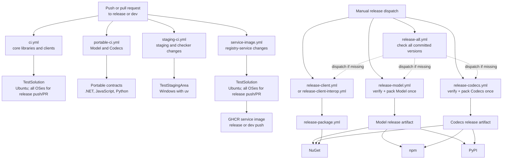

# ARC validation package registry

The ARC validation package registry (AVPR) is the source, staging area, and
service implementation for validation packages used by
[`arc-validate`](https://github.com/nfdi4plants/arc-validate) and DataHUB
continuous-quality-control pipelines.

The repository contains:

- `StagingArea/`: reviewed F# and Python validation-package submissions;
- `src/ValidationPackage.Model/`: portable validation-package domain types for
  .NET, JavaScript, and Python;
- `src/ValidationPackage.Codecs/`: portable YAML frontmatter and JSON codecs for
  the shared model on .NET, JavaScript, and Python;
- `src/AVPR.Staging/`: internal repository discovery, normalized content, and
  content hashing for staged validation packages;
- `src/AVPRClient/`: the generated .NET registry client;
- `src/AVPRClient.Interop/`: optional mappings between generated client DTOs and the portable model;
- `src/AVPRCI/`: publication tooling;
- `src/PackageRegistryService/`: the registry API and package-browser website;
- `build/`: the cross-platform build project used by local development and CI;
- `tests/` and `StagingAreaTests/`: library, API, contract, and package checks;
- `.github/workflows/`: focused core/package, staging, service-image, and release automation.

The production package browser and API are available at
[avpr.nfdi4plants.org](https://avpr.nfdi4plants.org).

## Documentation

The complete documentation is maintained as ordinary Markdown so it remains
readable both on GitHub and through the service's `/docs` pages:

- [Documentation home](docs/index.md)
- [Submit and version a validation package](docs/packages/submission.md)
- [Validation package metadata](docs/packages/metadata.md)
- [CWL command inputs](docs/packages/cwl-inputs.md)
- [Validation-packages configuration](docs/packages/validation-packages-config.md)
- [Development setup](docs/development/overview.md)
- [Testing changes](docs/development/testing.md)
- [CI/CD and releases](docs/operations/releases.md)

Endpoint-level API documentation is provided by the deployed
[Swagger UI](https://avpr.nfdi4plants.org/swagger).

## Quick start

The SDK is pinned by `global.json` (currently .NET 10). The build project has
thin wrappers for Windows (`build.cmd`) and Unix (`build.sh`). Build and test
the main solution with:

```shell
./build.sh TestSolution
```

Run staging-area checks with:

```shell
./build.sh TestStagingArea
```

Run the portable model contract suite on all three targets with:

```shell
./build.sh TestPortableModel
```

Run the portable codec suite on all three targets with:

```shell
./build.sh TestPortableCodecs
```

## CI/CD workflow map

Automation is split by responsibility. Core, portable, staging, and service
checks use path-focused workflows, while each publishable package has an
explicit manual release workflow.


```mermaid
flowchart TD
    Changes["Push or pull request<br/>to release or dev"]
    Manual["Manual release dispatch"]

    Changes --> CoreCI["ci.yml<br/>core libraries and clients"]
    Changes --> PortableCI["portable-ci.yml<br/>Model and Codecs"]
    Changes --> Staging["staging-ci.yml<br/>staging and checker changes"]
    Changes --> Service["service-image.yml<br/>registry-service changes"]

    CoreCI --> Core["TestSolution<br/>Ubuntu; all OSes for release push/PR"]
    PortableCI --> Portable["Portable contracts<br/>.NET, JavaScript, Python"]

    Staging --> StagingTests["TestStagingArea<br/>Windows with uv"]

    Service --> ServiceTests["TestSolution<br/>Ubuntu; all OSes for release push/PR"]
    ServiceTests --> Image["GHCR service image<br/>release or dev push"]

    Manual --> ReleaseAll["release-all.yml<br/>check all committed versions"]
    Manual --> ModelRelease["release-model.yml<br/>verify + pack Model once"]
    Manual --> CodecsRelease["release-codecs.yml<br/>verify + pack Codecs once"]
    Manual --> ClientRelease["release-client.yml<br/>or release-client-interop.yml"]
    ReleaseAll -. "dispatch if missing" .-> ModelRelease
    ReleaseAll -. "dispatch if missing" .-> CodecsRelease
    ReleaseAll -. "dispatch if missing" .-> ClientRelease

    ModelRelease --> ModelArtifact["Model release artifact"]
    CodecsRelease --> CodecsArtifact["Codecs release artifact"]
    ModelArtifact --> NuGet["NuGet"]
    ModelArtifact --> Npm["npm"]
    ModelArtifact --> PyPI["PyPI"]
    CodecsArtifact --> NuGet
    CodecsArtifact --> Npm
    CodecsArtifact --> PyPI
    ClientRelease --> NuGetPublisher["release-package.yml"]
    NuGetPublisher --> NuGet
```

Publication jobs use the protected `release` environment and OIDC trusted
publishing. Model and Codecs each pack once, preserve that build as a workflow
artifact, and fan out to independent NuGet, npm, and PyPI jobs. Failed registry
jobs can therefore be retried without rebuilding or rerunning successful
registry jobs. Registry policies must authorize the exact workflow filename
that performs each publish job; the complete field values are documented in
[release operations](docs/operations/releases.md#trusted-publisher-configuration).
`release-all.yml` is an optional repository-level button that checks NuGet,
npm, and PyPI and dispatches those existing trusted workflows only for versions
that are not fully published.

On Windows, replace `./build.sh` with `.\build.cmd`.

With Docker Desktop running, start the registry service, PostgreSQL, and Adminer
development stack with:

```shell
docker compose up --build
```

Discover the dynamically assigned service port with:

```shell
docker compose port packageregistryservice 8080
```

See [development setup](docs/development/overview.md) for the VS Code
`dotnet watch` workflow and [testing changes](docs/development/testing.md) for
focused commands.

## Contributing packages

Each package is a self-contained `.fsx` or `.py` script under
`StagingArea/<package-name>/`. Its directory, filename, and frontmatter identity
must agree. Published versions are immutable, so updates use a new semantic
version.

Start with [submitting a validation package](docs/packages/submission.md) and
the [metadata reference](docs/packages/metadata.md).

## License

This repository is licensed under the terms in [LICENSE](LICENSE).
